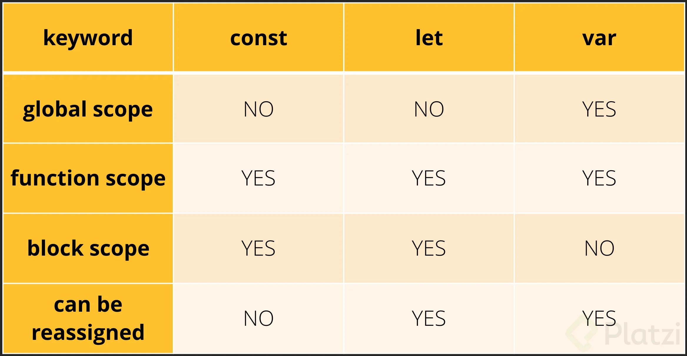

# ecmascript

Curso de ecmaScrip

JavaScript es el lenguaje más utilizado para desarrollo de aplicaciones web, principalmente en el frontend. Cada año, ECMA International publica una nueva edición de ECMAScript, la especificación a la cual se ajusta JavaScript. Aprende las nuevas características que implementa ECMAScript desde la versión 6 hasta la versión 10.

* Dominar las funcionalidades incluidas en ECMA
* Entender qué es ECMAScript y por qué es tan importante

En este curso se abordo desde el ecmascript 6 hasta el mas actual, ademas a destacar se aprendio que son las promesas en js

